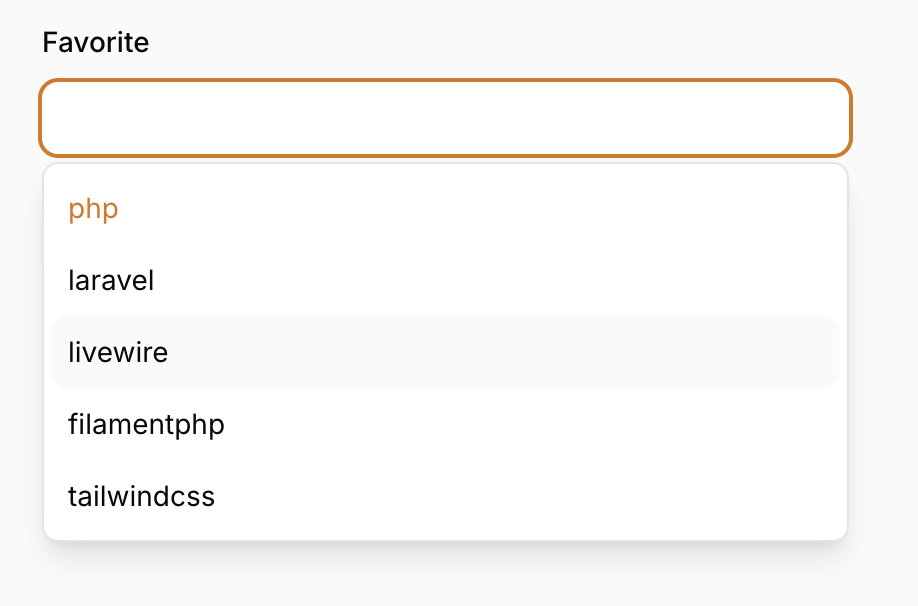

# FilamentPHP TextInput Field with Autocomplete feature

[](https://packagist.org/packages/borjajimnz/text-input-autocomplete)
[](https://github.com/borjajimnz/text-input-autocomplete/actions?query=workflow%3A"Fix+PHP+code+style+issues"+branch%3Amain)
[](https://packagist.org/packages/borjajimnz/text-input-autocomplete)

This package replaces the native `<datalist>` functionality with a custom, non-native autocomplete for the TextInput component in FilamentPHP 3, offering enhanced flexibility and customization options.



## Installation

You can install the package via composer:

```bash
composer require borjajimnz/text-input-autocomplete
```

## Usage

By default, we will use a non-native datalist. If you want to use the native one, simply add `->datalistNative()`.

```php
use Borjajimnz\TextInputAutocomplete\Forms\Components\AutoComplete;

AutoComplete::make('favorite')
    ->datalist(function () {
        return ['php','laravel','filamentphp', 'tailwindcss'];
    });
```

These are all the options available to configure your field, if needed.

```php
use Borjajimnz\TextInputAutocomplete\Forms\Components\AutoComplete;

AutoComplete::make('favorite')
    ->datalistNative(false)
    ->datalistMinCharsToSearch(0)
    ->datalistMaxItems(false)
    ->datalistDisableScroll(false)
    ->datalistOpenOnClick(true)
    ->datalist(function () {
        return ['php','laravel','filamentphp', 'tailwindcss'];
    });
```

Or if you want to use the native datalist with a custom ID.

```php
use Borjajimnz\TextInputAutocomplete\Forms\Components\AutoComplete;

AutoComplete::make('favorite')
    ->datalistNativeId('customized.id')
    ->datalist(function () {
        return ['php','laravel','filamentphp', 'tailwindcss'];
    });
```

## Security Vulnerabilities

Please review [our security policy](../../security/policy) on how to report security vulnerabilities.

## Credits

- [FilamentPHP](https://github.com/filamentphp)
- [Laravel](https://github.com/laravel)

## License

The MIT License (MIT). Please see [License File](LICENSE.md) for more information.
